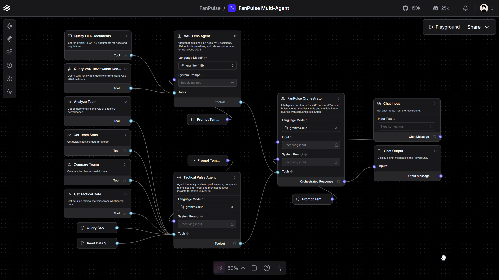

# FanPulse ⚽🤖

**AI-Powered Football Analysis for FIFA World Cup 2026**

An intelligent multi-agent system that demystifies VAR decisions and provides tactical insights using explainable AI. Built with IBM Granite, Docling, and LangFlow for the IBM Skills Build AI Builders Challenge.

[](https://www.ibm.com/products/watsonx-code-assistant)
[](https://www.ibm.com/granite)
[](https://github.com/DS4SD/docling)
[](https://www.langflow.org/)
[](https://www.python.org/)
[](LICENSE)

---

## 🎯 The Problem I'm Solving

### VAR Confusion & Tactical Complexity

Football fans worldwide face two major challenges during FIFA World Cup 2026:

1. **VAR Decision Confusion** 😕
   - "Why was that goal disallowed?"
   - "Was that really a penalty?"
   - "What's the actual offside rule?"
   - Complex referee decisions lack clear explanations for fans

2. **Tactical Understanding Gap** 📊
   - "How does Brazil actually play?"
   - "Who would win: Argentina vs France?"
   - "What are Germany's weaknesses?"
   - Fans want deeper insights beyond just scores and standings

**The Impact:**
- Frustrated fans questioning referee decisions
- Missed opportunities to appreciate tactical brilliance
- Reduced engagement with the beautiful game
- Barriers to understanding modern football

---

## 💡 My AI Solution

### FanPulse: Three Specialized AI Agents Working Together

```
User Question → Orchestrator → Right Agent → Expert Answer
```

#### 🎭 **FanPulse Orchestrator**
Smart coordinator that understands your question and routes it automatically:
- 🧠 Analyzes intent (VAR rules vs tactical analysis)
- 🔀 Routes to the right specialist
- ⚡ Calls multiple agents in parallel when needed
- 🎨 Combines results into unified answers

#### 🔍 **VAR-Lens Agent** 
Your personal VAR expert explaining referee decisions:
- 📚 **658-vector knowledge base** from 7 official FIFA/IFAB documents
- 🎯 Real match incidents database (World Cup 2026)
- 📖 Clear explanations with source citations
- 🤖 Powered by IBM Granite for natural language understanding

#### ⚽ **Tactical Pulse Agent**
Your tactical analyst providing performance insights:
- 📊 **49,000+ historical matches** (1872-2026)
- 🏆 **65 World Cup 2026 matches** with detailed tactical data
- 🎯 Advanced metrics: possession, xG, shots, passes, formations
- 🤖 AI-powered insights using IBM Granite

---

## 🚀 My Technical Approach



### Multi-Agent Architecture with Tool-Agent Separation

```
┌─────────────────────────────────────────┐
│  User: "What are handball rules and     │
│         how does Brazil play?"          │
└─────────────────────────────────────────┘
                    ↓
┌─────────────────────────────────────────┐
│  Orchestrator (IBM Granite)             │
│  - Detects 2 intents: VAR + Tactical    │
│  - Routes to both agents in parallel    │
└─────────────────────────────────────────┘
                    ↓
        ┌───────────┴───────────┐
        ↓                       ↓
┌──────────────────┐   ┌──────────────────┐
│  VAR-Lens Agent  │   │ Tactical Pulse   │
│  (IBM Granite)   │   │ Agent (Granite)  │
└──────────────────┘   └──────────────────┘
        ↓                       ↓
┌──────────────────┐   ┌──────────────────┐
│  Tools (JSON)    │   │  Tools (JSON)    │
│  - query_fifa_   │   │  - analyze_team  │
│    documents     │   │  - compare_teams │
│  - query_referee_│   │  - get_tactical_ │
│    decisions     │   │    data          │
└──────────────────┘   └──────────────────┘
                    ↓
┌─────────────────────────────────────────┐
│  Combined Response:                     │
│  1. Handball rules explained            │
│  2. Brazil's tactical analysis          │
└─────────────────────────────────────────┘
```

### Key Technical Components

#### 1. **IBM watsonx Code Assistant (Bob)** (Development Tool)
- AI-powered coding assistant used throughout development
- Accelerated component creation and debugging
- Enhanced productivity and code quality

#### 2. **IBM Granite LLM** (Core AI Engine)
- Powers all 3 agents with natural language understanding
- Supports both local Granite 4.1 8B (Ollama) and cloud deployment
- Generates human-friendly explanations from structured data

#### 3. **IBM Docling** (Document Processing)
- Converted 7 FIFA/IFAB PDFs to clean Markdown
- Enabled efficient RAG pipeline
- High-quality text extraction for vector embeddings

#### 4. **RAG Pipeline** (Knowledge Retrieval)
- FAISS vector store with 658 embeddings
- Semantic search for relevant FIFA rules
- Source citation for transparency

#### 5. **LangFlow** (Visual Orchestration)
- No-code multi-agent workflow
- Real-time testing and debugging
- Agent coordination and parallel execution

#### 6. **Tool-Agent Separation Pattern**
```python
# Tools: Pure functions returning JSON
def analyze_team(team_name: str) -> dict:
    """Returns raw JSON data"""
    return {
        "team": "Brazil",
        "matches": 1031,
        "win_rate": 67.2,
        "goals_scored": 2323
    }

# Agents: Interpret and format for humans
"""
## 🎯 Brazil - Tactical Profile

Brazil's impressive 67.2% win rate across 1,031 
international matches reveals a team built on 
attacking excellence, with 2,323 goals scored...
"""
```

**Benefits:**
- ✅ Reusable tools across agents
- ✅ Testable pure functions
- ✅ Flexible formatting per agent
- ✅ Maintainable codebase

---

## 🌟 Why This Matters for Football & World Cup

### 1. **Democratizing VAR Understanding** 🎥
- **Before**: Fans confused by referee decisions, relying on biased commentary
- **After**: Instant access to official FIFA rules with clear explanations
- **Impact**: Reduced controversy, increased trust in officiating

### 2. **Elevating Tactical Appreciation** 📊
- **Before**: Casual fans only see scores, miss tactical brilliance
- **After**: AI-powered insights reveal playing styles, strengths, weaknesses
- **Impact**: Deeper engagement, appreciation for the beautiful game

### 3. **Bridging the Knowledge Gap** 🌉
- **Before**: Complex football concepts accessible only to experts
- **After**: Natural language AI makes analysis accessible to everyone
- **Impact**: More informed fans, richer discussions

### 4. **Real-Time World Cup Companion** ⚡
- **Before**: Wait for post-match analysis from pundits
- **After**: Instant answers during live matches
- **Impact**: Enhanced viewing experience, immediate understanding

### 5. **Explainable AI for Sports** 🔍
- **Before**: Black-box AI predictions without reasoning
- **After**: Every answer cites official sources and data
- **Impact**: Trust, transparency, educational value

---

## 🚀 Quick Start

> **Environment Note:** FanPulse runs entirely inside **LangFlow Desktop**. The Python components are loaded and executed by LangFlow itself — you do **not** run any Python scripts manually. Once you install Python, LangFlow, and import the workflow JSON, the system is ready!

---

### Prerequisites

| Requirement | Required? | Notes |
|---|---|---|
| **Python 3.11+** | ✅ Yes | LangFlow needs Python to execute the custom tool components |
| **LangFlow Desktop** | ✅ Yes | The entire workflow runs here — download from [langflow.org](https://www.langflow.org/) |
| **Ollama + IBM Granite** | ✅ Yes (for local) | Download from [ollama.com](https://ollama.com), then run `ollama pull granite4.1:8b`. Alternatively use IBM Granite Cloud API. |
| `pip install -r requirements.txt` | ✅ Yes | Required libraries (pandas, faiss-cpu, etc.) must be installed in the same Python environment that LangFlow uses |
| Virtual environment setup | ⚠️ Optional | Recommended to keep dependencies clean, but not strictly required |

---

### Installation

```bash
# 1. Clone repository
git clone https://github.com/babaksh/FanPulse.git
cd FanPulse

# 2. Install dependencies into the Python environment that LangFlow uses
pip install -r requirements.txt

# 3. Pull IBM Granite via Ollama
ollama pull granite4.1:8b
```

> ⚠️ **Important:** Make sure you run `pip install` in the **same Python environment** that LangFlow Desktop is using. If you install in a separate venv but LangFlow uses the system Python, the components will fail to import.

---

### Required Data Files

FanPulse uses backend data that lives **outside LangFlow** — these files must be present in your local copy of the repository. The workflow JSON references them by absolute path (see step 2 of Setup below).

Copy the project folder to your machine and make sure the following data is intact:

#### 📊 `data/match_data/` — Match Results & Tactical Data

| File | Source | Description |
|---|---|---|
| **`results.csv`** | IBM Lab | ~49,000 international matches from 1872–2026. Result data sourced and provided through IBM Lab infrastructure. Updated daily. |
| **`tactical_data.csv`** | Added manually | Detailed tactical stats (41 metrics) for all World Cup 2026 matches played so far — formations, possession, shots, passing, pressing intensity, etc. Collected via WhoScored scraper and updated continuously as new matches are played. |
| **`data_schema.json`** | Added manually | Full schema reference used by AI agents to understand every column, calculated metric, and query pattern in both CSV files. The model reads this to interpret data correctly. |

#### 🟥 `data/referee_decisions/` — VAR & Red Card Decisions

JSON files, one per match, containing VAR-reviewable incidents: goals under review, penalty decisions, and red card events. The VAR-Lens agent queries these to explain real match decisions in the context of FIFA laws.


#### 📚 `data/vector_stores/var_lens/` — FIFA Rules Knowledge Base

A pre-built FAISS vector store containing FIFA/IFAB documents, parsed via IBM Docling and embedded. This is the retrieval backend for the VAR-Lens agent's RAG pipeline. The files `index.faiss` and `index.pkl` must be present — they are already built and included in the repository.

---

### Setup in LangFlow

**Step 1 — Import Workflow**
- Open LangFlow Desktop
- Import: `langflow_workflows/FanPulse_Multi_Agent.json`

**Step 2 — Update Absolute File Paths** ⚠️
Each custom component has a hardcoded base path (`d:/MyPythonProjects/FanPulse/`). You must update this to match where you cloned the repository on your machine.

Open each component listed below and replace the base path:

| Component | File |
|---|---|
| `query_fifa_docs_tool.py` | VAR-Lens: FIFA rules retrieval |
| `query_referee_decisions_tool.py` | VAR-Lens: match decision lookup |
| `analyze_team_tool.py` | Tactical Pulse: team analysis |
| `compare_teams_tool.py` | Tactical Pulse: team comparison |
| `get_tactical_data_tool.py` | Tactical Pulse: tactical stats |
| `get_team_stats_tool.py` | Tactical Pulse: team statistics |
| `query_csv_tool.py` | Tactical Pulse: CSV queries |
| `read_schema_tool.py` | Reads `data_schema.json` for the agent |

**Step 3 — Configure IBM Granite**
- In each agent node, select **Ollama** → **`granite4.1:8b`**
- Or configure the IBM Granite Cloud API credentials

**Step 4 — Run!**
- Click the **Run** button in LangFlow
- Start asking questions in the chat panel

---

## 💻 Usage Examples

### Simple Questions

#### VAR Rule Explanation
```
Q: "What is the offside rule?"

Agent: VAR-Lens
Tools: query_fifa_documents("offside rule")

Response:
## 📋 Offside Rule (Law 11)

### Overview
A player is in an offside position if they are nearer to 
the opponent's goal line than both the ball and the 
second-last opponent when the ball is played to them...

### 📚 Source
Official FIFA/IFAB Documents (Laws of the Game 2026/27)
```

#### Team Analysis
```
Q: "Analyze Brazil's performance"

Agent: Tactical Pulse
Tools: analyze_team("Brazil")

Response:
## 🎯 Brazil - Tactical Profile

Brazil's impressive 67.2% win rate across 1,031 matches 
reveals a team built on attacking excellence...

### 📊 Performance Analysis
- **Matches**: 1,031
- **Win Rate**: 67.2%
- **Goals Scored**: 2,323
- **Goal Difference**: +1,124

### ⚽ Tactical Identity
Brazil's 4-2-3-1 formation emphasizes possession-based 
build-up with creative attacking midfielders...
```

### Real Match Incident

```
Q: "What happened at minute 34 in Argentina vs Algeria?"

Agent: VAR-Lens

Response:
## 🎥 Referee Decision: Argentina vs Algeria - Minute 34

### 📋 What Happened
**Incident Details:**
- **Player**: Lautaro Martinez
- **Team**: Argentina (Home)
- **Decision Type**: VAR Review — Goal Disallowed
- **Reason**: Offside

### 🎥 VAR Review Process
**Initial On-Field Decision**: Goal awarded
**VAR Check**: Possible offside in build-up
**Final Decision**: Goal disallowed
**Outcome**: Overturned ✗

### 📖 The Official Rule Applied
According to FIFA Law 11, a player is in an offside position
if any part of the head, body or feet is nearer to the
opponents' goal line than both the ball and the
second-last opponent...

### 📚 Sources
- Referee Decisions Database
- Official FIFA/IFAB Documents
```

### Combined Questions (Multi-Agent)

```
Q: "What are handball rules and compare Germany vs France?"

Orchestrator: Detects 2 intents → Calls both agents in parallel

Agent 1: VAR-Lens
Tools: query_fifa_documents("handball rules")

Agent 2: Tactical Pulse  
Tools: compare_teams("Germany", "France")

Response:
## 📋 Handball Rules According to FIFA (Law 12)
[Full handball rule explanation...]

---

## ⚖️ Germany vs France - Tactical Head-to-Head

### 📊 Historical Record
**Total meetings:** 35
- **Germany wins:** 11
- **France wins:** 16
- **Draws:** 8

### 🎯 Tactical Matchup
Germany's possession-based approach (58% avg) clashes 
with France's counter-attacking style...

### 💡 Prediction
France holds a slight edge due to recent form and 
psychological advantage from 16 wins vs 11...
```

### Complex Tactical Question

```
Q: "Show me all World Cup 2026 matches where teams had 
    over 65% possession but lost"

Agent: Tactical Pulse
Tools: 
  1. read_schema() → Get column names
  2. query_csv(
       query_mode="custom",
       table="tactical_data",
       custom_filter="(home_possession > 65) & (home_score < away_score) | 
                      (away_possession > 65) & (away_score < home_score)"
     )

Response:
## 📊 High Possession Defeats - WC 2026

### 📈 What This Reveals
3 matches where dominant possession didn't translate to victory:

1. **Spain 1-2 Morocco** (June 15, 2026)
   - Spain: 68% possession, 18 shots
   - Morocco: 2 goals from 6 shots (33% conversion)
   - **Insight**: Clinical finishing beats possession

2. **Germany 0-1 Japan** (June 18, 2026)
   - Germany: 71% possession, 22 shots
   - Japan: 1 goal from 4 shots (25% conversion)
   - **Insight**: Counter-attacking masterclass

3. **Netherlands 2-3 Argentina** (June 21, 2026)
   - Netherlands: 66% possession, 20 shots
   - Argentina: 3 goals from 9 shots (33% conversion)
   - **Insight**: Efficiency over dominance

### 💡 Key Tactical Insights
- Possession ≠ Goals
- Shot conversion matters more than shot volume
- Counter-attacking remains effective against possession teams

### 📚 Source
Tournament Tactical Database (WC 2026)
```

---

## 📁 Project Structure

```
FanPulse/
├── langflow_components/                   # LangFlow custom components
│   ├── fanpulse_orchestrator.py           # Main orchestrator agent
│   ├── var_lens_agent.py                  # VAR rules expert agent
│   ├── tactical_pulse_agent.py            # Tactical analysis agent
│   ├── query_fifa_docs_tool.py            # FIFA documents RAG tool
│   ├── query_referee_decisions_tool.py    # Match incidents tool
│   ├── analyze_team_tool.py               # Team analysis tool
│   ├── compare_teams_tool.py              # Head-to-head comparison tool
│   ├── get_tactical_data_tool.py          # Tournament tactical data tool
│   ├── get_team_stats_tool.py             # Quick stats tool
│   ├── query_csv_tool.py                  # Custom CSV queries tool
│   └── read_schema_tool.py                # Data schema reader tool
│
├── langflow_workflows/                    # Workflow definitions & prompts
│   ├── ORCHESTRATOR_SYSTEM_PROMPT.md      # Orchestrator instructions
│   ├── VAR_LENS_SYSTEM_PROMPT.md          # VAR-Lens agent instructions
│   ├── TACTICAL_PULSE_SYSTEM_PROMPT.md    # Tactical Pulse instructions
│   └── FanPulse_Multi-Agent.json          # LangFlow JSON definition
│
│
├── scripts/                               # Utility scripts
│   ├── var_lens_setup/                    # VAR-Lens setup scripts
│       ├── build_var_lens_vectorstore.py  # Build FAISS vector store
│       ├── process_documents.py           # Process PDFs with Docling
│       └── README.md                      # Setup documentation
│   
│
├── data/                                  # Data files
│   ├── raw_documents/                     # 7 FIFA/IFAB PDFs
│   ├── processed_documents/               # 7 Markdown files (Docling output)
│   ├── vector_stores/                     # FAISS index
│   │   └── var_lens/                      # 658 vectors, 1.01 MB
│   ├── match_data/                        # Match datasets
│   │   ├── results.csv                    # 49,000+ historical matches
│   │   ├── tactical_data.csv              # WC 2022 + WC 2026 tactical stats
│   │   ├── data_schema.json               # Complete data structure
│   │   └── README.md                      # Data documentation
│   └── referee_decisions/                 # Match-specific referee decisions
│       └── WC_2026-06-*.json              # World Cup 2026 matches
│
├── README.md                              # This file
├── LICENSE                                # MIT License
└── requirements.txt                       # Python dependencies
```

---

## 🔧 Available Tools

### VAR-Lens Tools

#### 1. query_fifa_documents
Search official FIFA/IFAB documents for rules and protocols.
```python
query_fifa_documents(question="handball rules")
# Returns: Relevant rule excerpts with source citations
```

#### 2. query_referee_decisions
Get VAR-reviewable decisions from World Cup 2026 matches.
```python
query_referee_decisions(
    home_team="Argentina",
    away_team="Algeria",
    var_only=True  # Optional: filter only VAR-reviewed
)
# Returns: Match incidents with decision details
```

### Tactical Pulse Tools

#### 3. analyze_team
Comprehensive team profile (historical + tactical).
```python
analyze_team(team_name="Brazil")
# Returns: Complete team analysis with stats and insights
```

#### 4. compare_teams
Head-to-head comparison of exactly two teams.
```python
compare_teams(team1="Germany", team2="France")
# Returns: H2H record, tactical matchup, prediction
```

#### 5. get_tactical_data
Detailed tactical stats for one team.
```python
get_tactical_data(
    team_name="Spain",
    tournament_prefix="WC_2026"  # Optional
)
# Returns: Possession, shots, passes, formations
```

#### 6. get_team_stats
Quick statistical overview for one team.
```python
get_team_stats(team_name="Argentina")
# Returns: Matches, wins, goals, form
```

#### 7. query_csv
Flexible CSV querying with Simple and Custom modes.
```python
# Simple mode
query_csv(
    query_mode="simple",
    table="tactical_data",
    team_filter="Brazil",
    min_possession=60
)

# Custom mode (requires read_schema first)
query_csv(
    query_mode="custom",
    table="tactical_data",
    custom_filter="(home_possession > 65) & (home_score < away_score)"
)
```

#### 8. read_schema
Get complete data schema before custom queries.
```python
read_schema()
# Returns: Tables, columns, data types, formats, examples
```

---

## 🔒 Security & Safety

### Prompt Injection Prevention
- ✅ Input validation rejects malicious prompts
- ✅ Scope enforcement (football-only)
- ✅ System instruction protection

### Data Protection
- ✅ No file paths or schemas exposed
- ✅ No API keys or credentials revealed
- ✅ Output validation before delivery

### Domain Restriction
- ✅ Football-only scope
- ✅ Polite redirection for off-topic questions
- ✅ No opinions or controversial topics

---

## 📚 Setup Vector Database


### Process Documents
```bash
python scripts/var_lens_setup/process_documents.py
```

### Build Vector Store
```bash
python scripts/var_lens_setup/build_var_lens_vectorstore.py
```

---

## 📄 License

MIT License - see [`LICENSE`](LICENSE) file for details.

---

**Made with ❤️ for IBM AI Builders Challenge**
